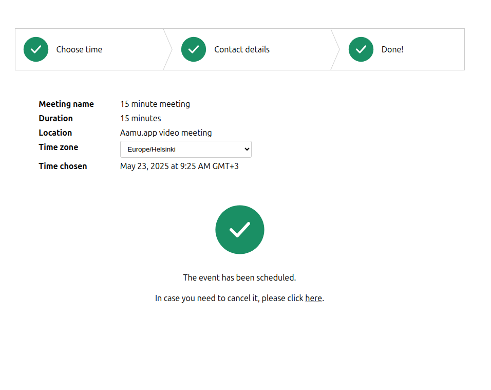

Did you know that you can use Aamu.app as a Calendly alternative? Well, you can, and more, since you can tie it up with Aamu.app’s video meetings. Here’s how.

First, go to: Project settings → Tasks → Event Booking

There you will see a host of settings. Set them as you would like — there are a lot of configuration options. In the end, what you want is the link to the event calendar. It looks like this: <a target="_blank" rel="noopener noreferrer nofollow" href="https://ilkkah.aamu.app/book-event/1700500094527/15-minute-meeting">https://ilkkah.aamu.app/book-event/1700500094527/15-minute-meeting</a>

You can use that link to pass it to anyone who you would like to invite into the meeting. So, copy the link, and send it all the people you think might want to have meetings with you!

What you will find in the URL, looks like this:

So, it’s a basic event calendar, with each hour separated and weekends (or unavailable days) grayed out. From each “hour” you get a list of available times to choose from.

User’s time zone is pre-selected and visible, since when people are selecting times from a calendar, the time zone matters. 

The event calendar also shows the type of meeting, which you can set in the settings. Video meeting here.

Next you will enter your contact details:

And in the next screen everything is done:

At this point you should see a new task in Tasks listing:

Also, a new Meeting is created, which you can see in the task details:

And in the Meetings listing:
<h2>In Summary</h2>
Event calendar will create a new Task and a new Meeting.

A Task is created because Tasks are the most versatile way to handle upcoming events. For example, Tasks can be synced with Google calendar, which makes them even more useful.

