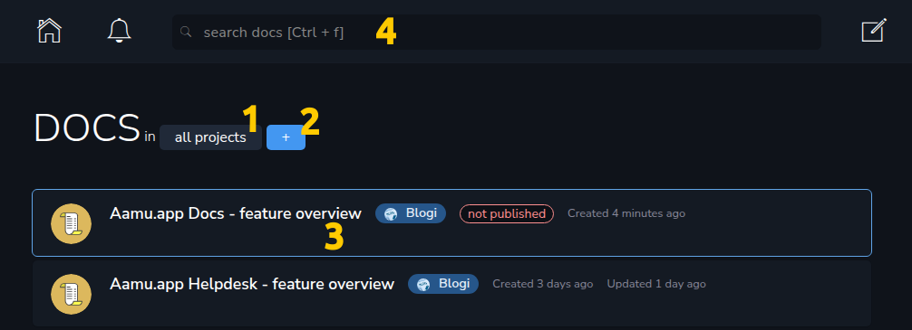
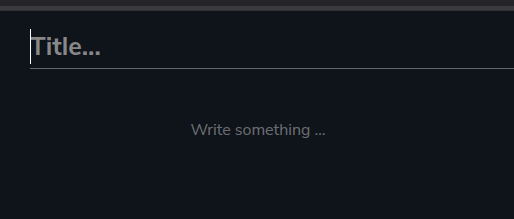
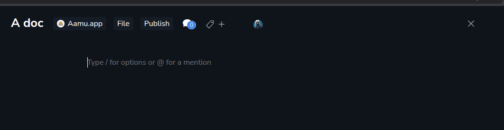
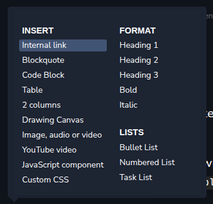
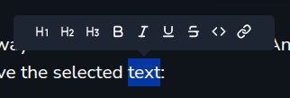
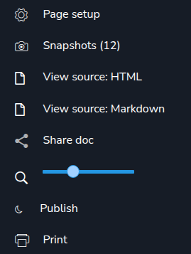
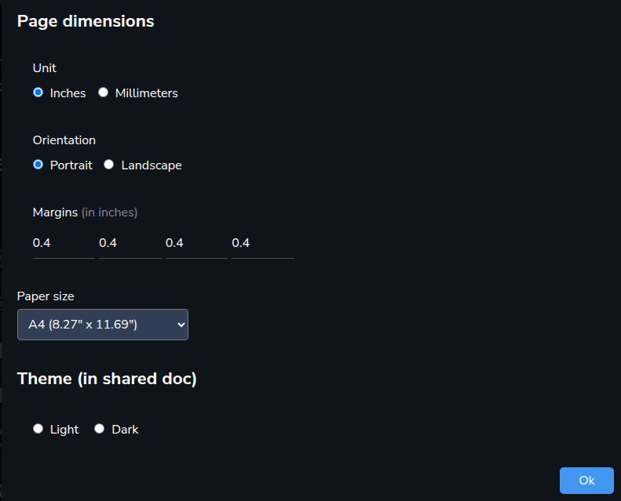

Let’s see the Docs main page. It has all the familiar elements:
<ol xmlns="http://www.w3.org/1999/xhtml"><li>
Project picker (or all projects)
</li><li>
Add new Doc
</li><li>
Doc box
</li><li>
Search
</li></ol>
Let’s create a new doc:

We are met with a title and the content area. What else do we need at this stage? Let’s add a title:

So, we got a bit more. A project picker, File menu, <em>Publish</em> button, Chat section, tags, current editors.

Here I need to give a tip, if you like writing with a bigger font size, you can increase the zoom from the File menu or with <code>Ctrl + plus</code>. 
<h2 xmlns="http://www.w3.org/1999/xhtml">Bells 🔔 and whistles 🥳 </h2>
In the content area, you can get more options by typing <code>/</code> (slash). You will see a menu like this:

That’s one way to add elements to the doc. Another is to select some text, and a mdnu will appear above the selected text:

From there you can also spice up 🌶️ the text. And since we are got to the topic of spicing up, you can add emojis by typing <code>:</code> (colon). And you can add mentions by typing <code>@</code>.
<h2 xmlns="http://www.w3.org/1999/xhtml">File menu</h2>
Let’s see what the File menu has for us:
<h3 xmlns="http://www.w3.org/1999/xhtml">Page setup</h3>
First we have the Page setup:

This is mainly used for printing or saving to PDF, although there is the theme setting for shared docs.
<h3 xmlns="http://www.w3.org/1999/xhtml">Snapshots</h3>
In snapshots we see our doc in different stages — a snapshot is created automatically when new content is added. This way you can go back to a certain point in time, it’s your (and your team’s) time machine to the document. 
<h3 xmlns="http://www.w3.org/1999/xhtml">View source</h3>
You can view the source in HTML or markdown — and update the document from the source view.
<h3 xmlns="http://www.w3.org/1999/xhtml">Share doc</h3>
Normally the document is private. You can make a version of it public (as HTML and as PDF).
<h3 xmlns="http://www.w3.org/1999/xhtml">Zoom</h3>
Zooming can be done from the File menu and with <code>Ctrl + plus</code> and <code>Ctrl + minus</code>.
<h3 xmlns="http://www.w3.org/1999/xhtml">Publish</h3>
If the doc is in draft state (only the creator sees it), you can publish it so that the whole team sees it.
<h3 xmlns="http://www.w3.org/1999/xhtml">Print</h3>
You can print the doc from File menu or from the browser’s menus.
<h2 xmlns="http://www.w3.org/1999/xhtml">Collaboration</h2>
As we noticed, the top bar had <em>current editors</em>. This is to show, who are currently editing the document. The document can be edited by your whole team at the same time!

