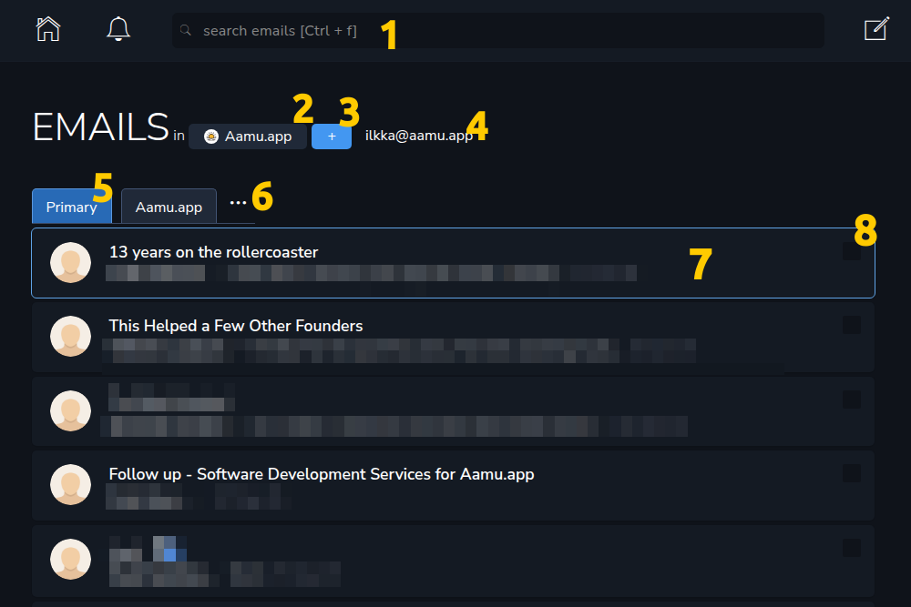
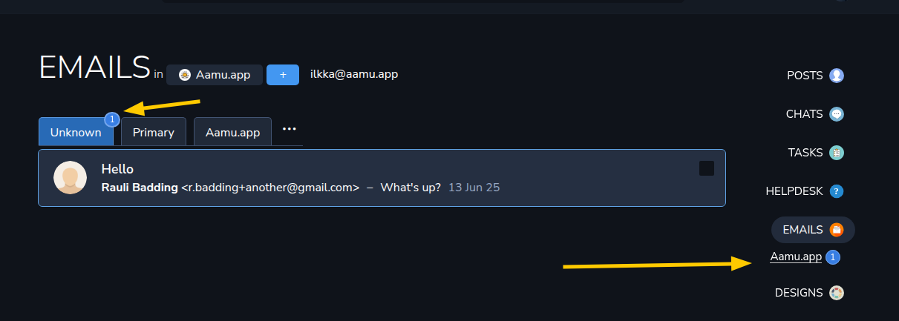
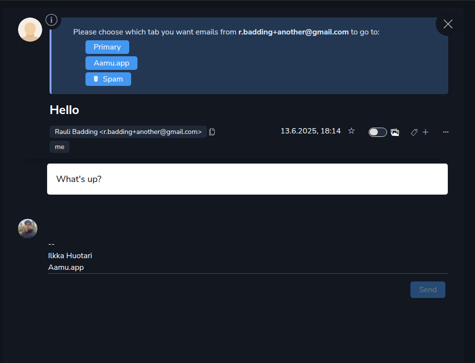

Earlier we configured Emails, now it’s time to see how to use it. At the main page of Email we see all the familiar elements:
<ol><li>
Search
</li><li>
Project picker
</li><li>
Compose a new email (keyboard short <code>c</code>)
</li><li>
Our email address (to make clear where we are, we could in some other project with a different email address)
</li><li>
Tabs. You can add more. The <em>Unknown</em> tab is activated when there are new emails from people we don’t yet know
</li><li>
More menu, like settings, sent emails, drafts
</li><li>
Email box, <em>currently active</em> email outlined.
</li><li>
Select checkbox — you can also select an item (like an email) with a keyboard shortcuts <code>.</code> and <code>s</code>. You can then perform group actions to multiple emails at once.
</li></ol>
So, the main page of the Emails section looks very similar to all other main page in Aamu.app. It’s because of the unified UI all around the app. That’s nice, isn’t it?
<h2>Email view</h2>
Let’s compose a new email:

What do we see here:
<ul><li>
Our <strong><em>Gravatar photo</em></strong> (using our email address ilkka@aamu.app)
</li><li>
The <strong><em>From</em></strong> field (us)
</li><li>
<strong><em>To</em></strong> field
</li><li>
<strong><em>Subject</em></strong> field
</li><li>
<strong><em>Email body</em></strong> (pre-filled with the footer we have defined in the settings)
</li></ul>
We are using <em>gravatars</em> in the email section, because they are universal and used by others.
<h2>Incoming emails</h2>
If the email is coming from an unknown source, the email will be seen in the Unknown tab:

And in the tab itself:

On the right sidebar, you will also see the project, where the incoming email is.

And when you click the email (or view it by pressing Enter when the correct email is outlined), you see this:

When we see a new email from an unknown source, we select the tab that it will go to. If it’s spam, the emails from this sender will be hidden from you in the spam folder.

Congratulations, the sender was worthy of getting into the <strong><em>Primary</em></strong> tab:
<ol><li>
Email subject
</li><li>
From
</li><li>
To
</li><li>
Email body 
</li><li>
Starring the email
</li><li>
Show images (will be remembered for the sender)
</li><li>
More menu
</li><li>
Our reply
</li><li>
Create task
</li></ol>
The notable thing here is the <em>Create task</em>. If the email requires further work, you can create a task from it.

