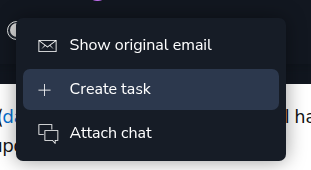
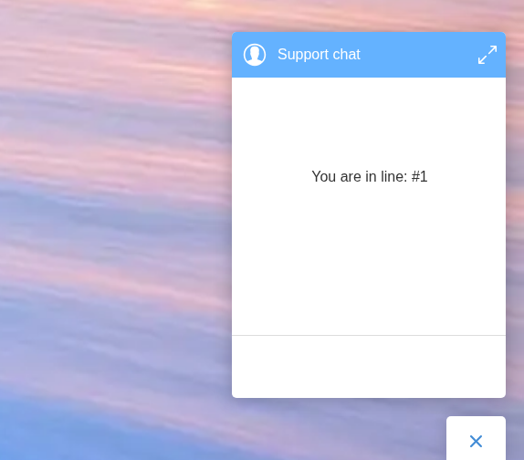
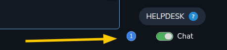
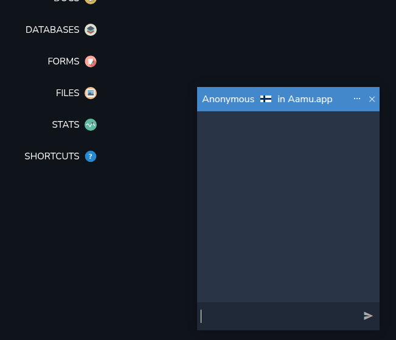

Earlier we configured helpdesk for <a target="_blank" rel="noopener noreferrer nofollow" href="https://aamu.app/blog/posts/setting-up-helpdesk-in-aamuapp-part-1-emails/" id="b7076d01-a97f-427f-ba60-5561e21abf60">emails</a> and <a target="_blank" rel="noopener noreferrer nofollow" href="https://aamu.app/blog/posts/setting-up-helpdesk-in-aamuapp-part-2-livechat/" id="219ba041-b7e7-439e-9df6-1f7fa8ba6469">livechat</a>, now is the time to take a general look at how to use the helpdesk. Here is the overall view of it:

<ol><li>
Project picker (which we see in every major section).
</li><li>
Support’s email address (if email is configured).
</li><li>
Since we have <em>Tickets</em> tab selected, we see the ticket subsections here.
</li><li>
Tabs - now <em>Tickets</em> selected.
</li><li>
Filtering menu.
</li><li>
Ticket “box” — shows one ticket (usually email). We see these boxes everywhere in Aamu.app, every major feature includes one or more.
</li><li>
Enable or disable livechat (if livechat is configured). When this is disabled, the livechat icon will show as an email ✉️ icon (for sending an email) and when this is enabled, the livechat icon will show a chat 🗨️ icon.
</li></ol><h2>Email tickets</h2>
When the ticket box is clicked, and the ticket is an email, you will see something like this:
<ol><li>
Title
</li><li>
Ticket status
</li><li>
Who the ticket is assigned to — when you reply to an email, the ticket will be assigned to you
</li><li>
Internal chat about the ticket — sometimes you need to talk about with your team
</li><li>
“Show images” — like in the emails, you may not want to show all images automatically, as it may not be safe
</li><li>
If this is spam, you can block the sender and this email
</li></ol>
In the “more menu” (three dots), there is one useful thing in particular:

It’s the <em>Create task</em>. As it sometimes happens, a customer request may spark some internal chain of events, we could require creating a task. This is for those cases.
<h2>Chat tickets</h2>
Let’s see how to handle livechat tickets.

First you would enable Chat:

Then you can see that on your site the chat icon is active:

Let’s click it:

So, now we are waiting for someone to answer us.

At Aamu.app side you will see a notification:

If we click the notification, we will see the Chat box:

Here we see, that Anonymous is wanting to chat and the country flag he/she is from. Let’s click the chat box. A chatting dialog appears in the bottom right of the screen:

When you type something and press Enter or click the send button the chat session initiates:

And the customer sees:

After chatting and ending the chat (either party can do it), there is still the opportunity to leave feedback:

After the chat is done, there will be a closed ticket created from it:
<h2>That’s it</h2>
Handling tickets isn’t very complicated.

