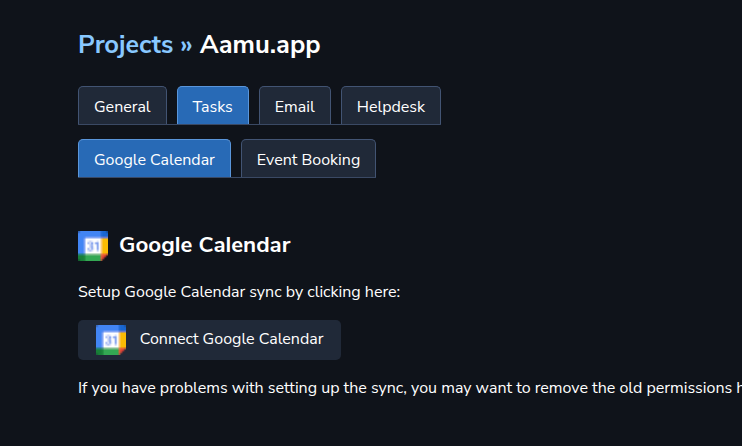

Let’s go through the features of Aamu.app Tasks. Here is the general overview with labels which we go through next:
<ol><li>
Search. Will search the currently selected project (or all projects if that is selected).
</li><li>
Currently selected project — or all projects combined.
</li><li>
Create new task.
</li><li>
Sort tasks menu.
</li><li>
Filter tasks menu.
</li><li>
View selector (list, kanban, calendar).
</li><li>
Create new task quickly in one-line input box.
</li><li>
Task box, showing one task’s details. The green corner is the task status, which is clickable, and closes the task, when clicked. This status indicator is also in many other item types accross Aamu.app.
</li><li>
A checkbox to select this task. Also the keyboard shortcut <code>.</code> (dot) will select/unselect the currently active task (denoted by the blue outline). You can perform actions to selected tasks (like close all of them and more).
</li><li>
Selected tab (Active tasks). There will also be Upcoming for tasks with deadlines.
</li><li>
More tabs, like completed tasks, archived tasks.
</li></ol>
Let’s take a look at the different views. List we already saw (above), there are also the kanban board (which we call Taskboard) and the calendar:
<h2>Kanban</h2>
Taskboard looks like this:

There is a lane/column for each possible task states. BTW, this view is also where you can add more task states, at the moment:

What does it mean when it says “to the left of this”? The leftmost lane (or state) will be the default, when a new task is created. Initially, when you create a new project, there are only two states, active (green) and closed (red). Each project can have its own task states. 
<h2>Calendar</h2>
Here’s what the calendar looks like:

As we can see, there isn’t a lot going on — my calendar looks empty (like it actually is). Only tasks which have a deadline defined are shown in the calendar.

If your calendar looks empty, you can sync the project with your Google Calendar:

Note that only project owners can sync their Google Calendar. So, if you want to do that, you can create a project of your own, and you will become that project’s owner automatically. Note that you need to be an <em>admin</em> to create projects. You can limit the visibility of your projects by adding (or not adding) members to it. Only the project members will see the project.
<h2>Task editing &amp; details</h2>
Let’s look at task details (when creating a new task or editing a task):
<ol><li>
The project the task is in.
</li><li>
Task’s state (you can add more states in Taskboard view).
</li><li>
Star the task (to make it more important). Everybody will see the star.
</li><li>
With “start” you can start time tracking for yourself, usually when you are doing the task. If you need time tracking (for billing for example), this is for you.
</li><li>
Edit task content (title, body). You can edit the title and body by clicking the place you want to edit, but in case you need a separate button, here it is.
</li><li>
Task’s title (and body below it).
</li><li>
Task’s comments (and other notifications).
</li><li>
Setting the deadline. 
</li><li>
Assigning the task to specific members. By default the task is assigned to its creator automatically (if you don’t want this, you need to just click <code>x</code> for remove user).
</li><li>
Task’s tags.
</li><li>
Custom fields. Every project has its own custom fields for tasks.
</li></ol>

