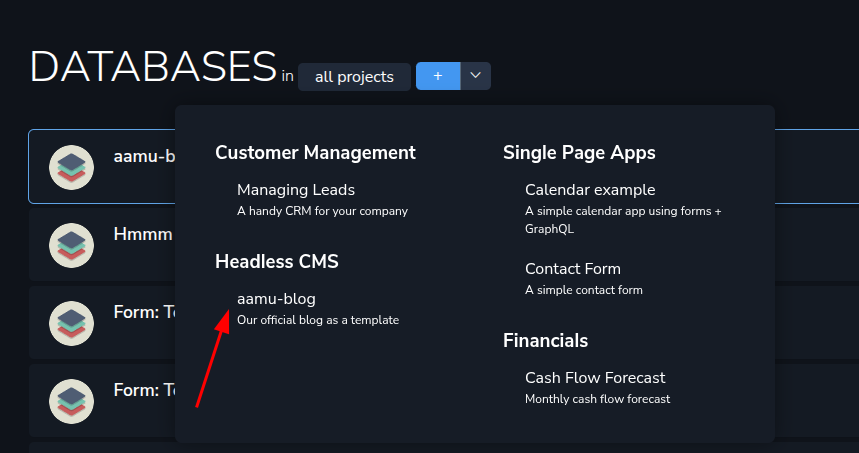
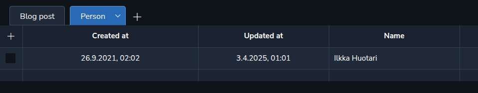
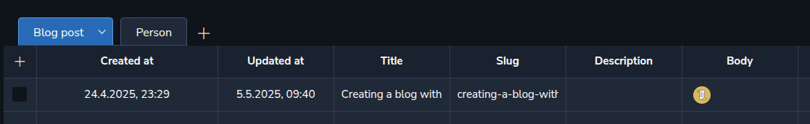
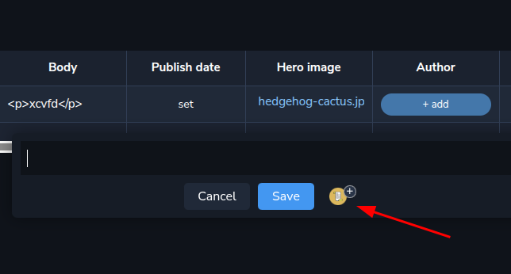
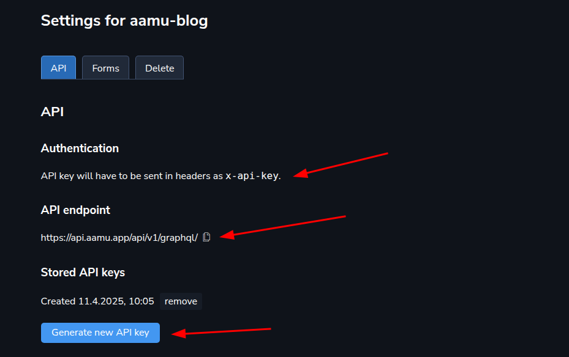
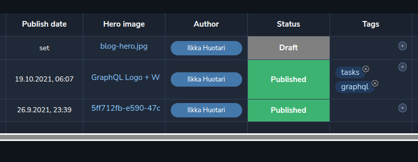
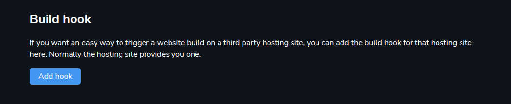

How to create a blog with Aamu.app? Here is how I have done it for Aamu.app’s official blog at <a target="_blank" rel="noopener noreferrer nofollow" href="https://aamu.app/blog/">https://aamu.app/blog/</a>.

The ingredients of this blog are:
<ul xmlns="http://www.w3.org/1999/xhtml"><li>
A database at Aamu.app
</li><li>
For writing the blog posts: documents at Aamu.app
</li><li>
For creating the actual blog: <a target="_blank" rel="noopener noreferrer nofollow" href="https://gohugo.io/" id="3cc0064a-8cad-48d6-93df-8f6ff1fd33b7">Hugo</a> static site generator
</li><li>
A server (with a shell access) to host the blog
</li><li>
Git to publish the blog to the server (pushing the repo)
</li><li>
Nginx for serving the static site (git repo)
</li></ul>
You can also use some other method to host the blog, for example Netlify. With this method you don’t need a server nor git. 

You can see the source code for the blog at <a target="_blank" rel="noopener noreferrer nofollow" href="https://github.com/AamuApp/aamu-blog">https://github.com/AamuApp/aamu-blog</a>.
<h2 xmlns="http://www.w3.org/1999/xhtml">The recipe</h2>
Here’s how it goes, from start to finish.
<h3 xmlns="http://www.w3.org/1999/xhtml">Create a database</h3>
Create a database at Aamu.app with the provided template <code>aamu-blog</code>:

You would use this database as what is known as a “Headless CMS” — the data from the database can be retrieved from the Aamu.app’s GraphQL database API.

Inside the database you will see two tables: <code>Blog post</code> and <code>Person</code>. If you are not happy with the names, you can rename them. The table <code>Blog post</code> is for posts (🧐) and <code>Person</code> is for post authors. 

You should first create a row in <code>Person</code> which you can then link into your posts:

Then create a row into <code>Blog post</code> table and fill the data accordingly. <code>Body</code> field will contain the blog posts HTML code. You can write the blog posts with Docs feature at Aamu.app, which we will get to next.

Here’s a row for a blog post. “Slug” is the url component of the post.

When you want to start writing the post, click the <code>Body</code> field of the row. You can write (copy-paste) HTML directly, or attach a Doc. Let’s attach a Doc:
<h3 xmlns="http://www.w3.org/1999/xhtml">Setting up the API key</h3>
In order to use the database as a headless CMS, it needs to be accessed from outside Aamu.app with GraphQL. You will need to create an API key and set it up for the blog build script.

To create an API key, go to database settings / API, and you will find what you need. Click “Generate new API key”, copy it and paste to aamu-blog’s <code>.env</code> file, which aamu-blog uses for environment variables.
<h3 xmlns="http://www.w3.org/1999/xhtml">Writing the blog post</h3>
We will use the Aamu.app’s Docs feature to write the blog post (just as I’m doing now). 

Writing a doc will automatically save the HTML code to the database’s <code>Body</code> field. So, writing the blog post is extremely easy.

You can also copy-paste the HTML to the <code>Body</code> field, if you want to write it with some other method.

When you are ready to publish the blog post, set the publishing date, author, possibly “Hero” image and any tags you would want, and set the status to “Published”.
<h3 xmlns="http://www.w3.org/1999/xhtml">Creating the blog with Hugo</h3>
Let’s create the actual blog now. 

The idea goes like this:
<ul xmlns="http://www.w3.org/1999/xhtml"><li>
The build script retrieves blog posts from Aamu.app through the GraphQL API. The script knows the timestamp when it did this the last time (the timestamp is saved into a file) and only gets the updated/new blog posts.
</li><li>
The same script saves them into content files, as well as any images.
</li><li>
Hugo is run to convert the content files into a blog
</li></ul>
The source code, which we use for our blog, is at <a target="_blank" rel="noopener noreferrer nofollow" href="https://github.com/AamuApp/aamu-blog">https://github.com/AamuApp/aamu-blog</a>. You can use it as a starting point for your own blog, or just get ideas from it.

You would typically use a development machine to create the blog and then upload (possibly with git) into the hosting server. 

You can also do all of this at a service like Netlify. If you want to use a service, they can usually be triggered to build the blog with a <em>build hook</em>. You can create such a build hook at your Aamu.app database’s settings: 
<h3 xmlns="http://www.w3.org/1999/xhtml">Publishing the blog</h3>
Still one thing to do: to actually publish the blog at the hosting server.

At the simplest, this can be done by uploading what Hugo created to the server. I have set up a git bare repo, with a <em>post-receive hook</em>, which handles the uploading part. Using git with a “bare repo” is a handy way to do this, but a bit more complex.
<h3 xmlns="http://www.w3.org/1999/xhtml">That’s It!</h3>
Let us know if there was something that left you wondering - how could I improve this tutorial? Join our <a target="_blank" rel="noopener noreferrer nofollow" href="https://discord.com/channels/922305146493489174/922305146946469890" id="108dc934-4e23-49f0-9bb8-56214bb85c38">Discord server</a> to tell!

