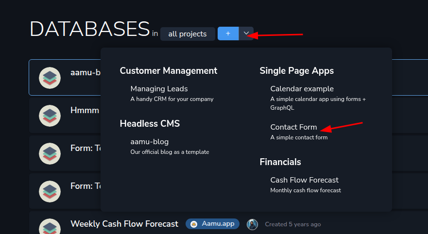
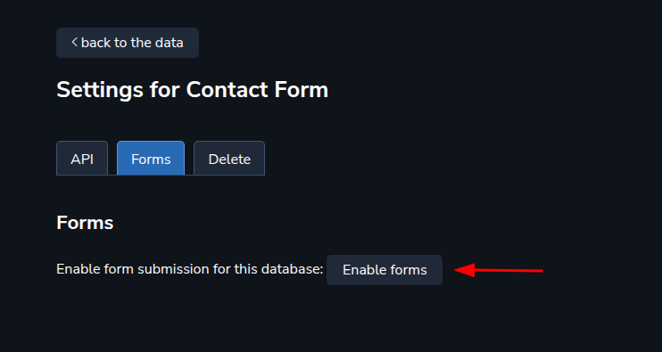
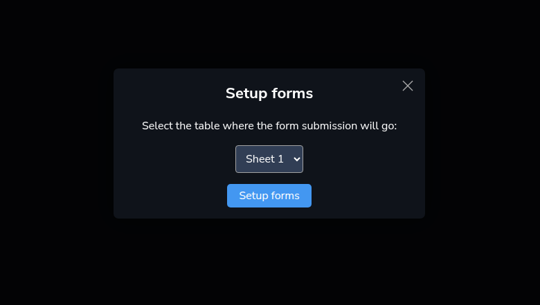
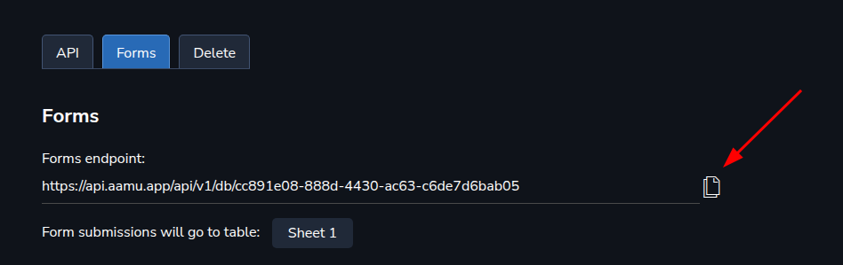
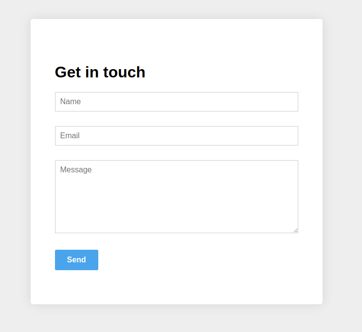

There are (at least) three ways to create a contact form with Aamu.app. Let’s look at the first one in detail.
<h2 xmlns="http://www.w3.org/1999/xhtml">Ingredients</h2>
The ingredients for this contact form are:
<ul xmlns="http://www.w3.org/1999/xhtml"><li>
HTML code for the form itself, which you can grab from <a target="_blank" rel="noopener noreferrer nofollow" href="https://github.com/AamuApp/contact-form">https://github.com/AamuApp/contact-form</a>
</li><li>
Aamu.app database, with <em>forms</em> enabled
</li></ul>
What you would do at your website is that you would add the HTML code, with CSS, to the appropriate location of your site, and tie the form to Aamu.app database with the Aamu.app database’s <code>endpoint url</code> and the Aamu.app database’s API key. Let’s see how to do all this.
<h2 xmlns="http://www.w3.org/1999/xhtml">Creating the Aamu.app database</h2>
We have a ready-made template of the database that you can use for storing the contact form’s data — it’s under the “arrow button” just next to the “plus button” that you would normally create an empty database with. So click the arrow button and select the <em>Contact Form</em>:
<h2 xmlns="http://www.w3.org/1999/xhtml">Setting up the database to accept form submissions</h2>
In the database settings, you should first enable the forms API:

You should select the table, where the form submissions will go to:

Then copy the <strong><em>Forms endpoint</em></strong>, and put it into the contact form’s HTML code, into <code>&lt;form action=”ENDPOINT HERE”&gt;</code>.
<h2 xmlns="http://www.w3.org/1999/xhtml">Creating the Form</h2>
To create the form, let’s start by grabbing the example HTML code from GitHub. The important part of it is the <code>&lt;form&gt;...&lt;/form&gt;</code>:
<pre xmlns="http://www.w3.org/1999/xhtml"><code class="language-html">&lt;form id="contactForm" action="ENDPOINT_HERE" method="POST" enctype="multipart/form-data" &gt;
	&lt;input type="hidden" name="redirect-error" value="https://api.aamu.app/api/v1/forms/error"&gt;
	&lt;input type="hidden" name="redirect-success" value="https://api.aamu.app/api/v1/forms/thank-you"&gt;
	&lt;div&gt;
		&lt;input placeholder="Name" type="text" name="name" id="form_name" required autofocus&gt;
	&lt;/div&gt;
	&lt;div&gt;
		&lt;input placeholder="Email" type="text" name="email" id="form_email" required&gt;
	&lt;/div&gt;
	&lt;div&gt;
		&lt;textarea placeholder="Message" name="message" id="form_message" required&gt;&lt;/textarea&gt;
	&lt;/div&gt;
	&lt;button id="submit" type="submit"&gt;Send&lt;/button&gt;
&lt;/form&gt;</code></pre>
The way this form works, is first by the <code>action="ENDPOINT_HERE"</code> which sends the form the API endpoint. 

Note the two hidden fields: <code>redirect-error</code> and <code>redirect-success</code>. You can set the redirect URLs with these. When sending the form with JavaScript, you won’t need these, but they are good to be there, since JavaScript isn’t always enabled by the user.
<h3 xmlns="http://www.w3.org/1999/xhtml">Form input field bindings</h3>
Another important point is how the form input fields’ names are matched to the database fields. The way the input field names are created is pretty straightforward — they are basically lowercase words with spaces turned into underscores. The correct input field names can also be seen in the <strong><em>Database settings / Forms</em></strong>. You can copy the <code>&lt;form&gt;</code>‘s HTML code there and use it in your applications.

The form which you can get from <a target="_blank" rel="noopener noreferrer nofollow" href="https://github.com/AamuApp/contact-form" id="0ec9cb15-f76c-45a5-982b-b3d57ca1801b">GitHub</a> has some other niceties — for example it is submitted by JavaScript on the fly, without causing a round-trip at the server (Aamu.app’s server).

For example, in our contact form database, there are three fields: <code>Name</code>, <code>Email</code>, <code>Message</code>. These correspond to form input fields <code>name</code>, <code>email</code>, <code>message</code>. 
<h3 xmlns="http://www.w3.org/1999/xhtml">That’s about it!</h3>
Now, if you have the form in place, point your browser to it, and test if. All the form submissions should end up in the database.

