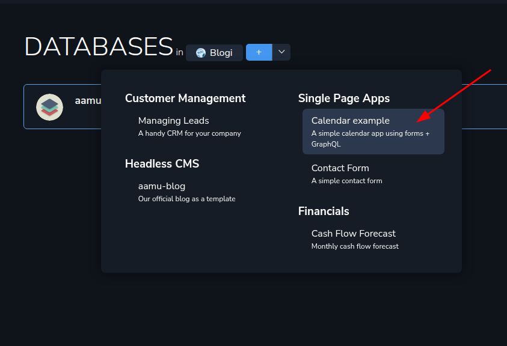
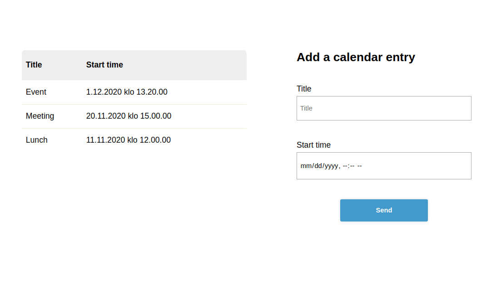

This time, let’s create a simple application, which uses just HTML, JavaScript and Aamu.app’s database through GraphQL. So, it’s what is known as a <a target="_blank" rel="noopener noreferrer nofollow" href="https://en.wikipedia.org/wiki/Single-page_application" id="e95e17ae-a128-459b-be7b-25bf646a5406">single-page application</a>. The source code for this application (well, one HTML file with some JavaScript in it) is at <a target="_blank" rel="noopener noreferrer nofollow" href="https://github.com/AamuApp/example-calendar" id="b4a5f114-360a-465f-a38e-78165fde9935">GitHub</a>. 
<h2 xmlns="http://www.w3.org/1999/xhtml">Using this in real life</h2>
A small warning is in order: this uses the database API key, which gives write permissions to the database. So, using this on the public Internet like this is not advised. In those cases you should do the API access on the server side.

You can see the general principle here and maybe that will guide you enough into real applications.
<h2 xmlns="http://www.w3.org/1999/xhtml">Create the database</h2>
First you need the database at Aamu.app. Conveniently, we have a template for it. You can create a database from the template in here:
<h2 xmlns="http://www.w3.org/1999/xhtml">The App</h2>
We will create a sort of reservation calendar, which accepts entries consisting of a title and a date, and show the current entries as a list. It would look like this:

The list of entries is fetched from the database with GraphQL, for which you would need an API KEY, which you can create in the <em>Database Settings</em>.

A new entry is submitted through the <em>Forms endpoint</em>, which you can also get in the <em>Database Settings</em>. We could also send the form data through GraphQL API, but using the forms endpoint is easy and enough for this application.

Both of these should be set in the HTML file, where is says like this:
<pre xmlns="http://www.w3.org/1999/xhtml"><code class="language-javascript">// Set these!
const API_KEY = '';
const FORM_ENDPOINT = '';</code></pre><h2 xmlns="http://www.w3.org/1999/xhtml">How the GraphQL part works here?</h2>
So, when the HTML file is loaded into the browser, this happens:
<pre xmlns="http://www.w3.org/1999/xhtml"><code class="language-typescript">async function getData() {
	try {
		const response = await fetch('https://api.aamu.app/api/v1/graphql/', {
			method: 'POST',
			headers: {
				'Content-Type': 'application/json',
				'Accept': 'application/json',
				'x-api-key': API_KEY
			},
			body: JSON.stringify({ query: `
				{
				Sheet1Collection(sort: { startTime: DESC }) {
					id
					created_at
					updated_at
					title
					startTime
				}
				}
			`})
		});
		if (!response.ok) throw new Error(`HTTP error: ${response.status}`);
		const data = await response.json();
		if (data?.errors) {
			data.errors.forEach(e =&gt; setError(e.message));
		} else if (data?.data) {
			handleData(data.data);
		} else {
			setError('No data returned from API');
		}
	} catch (err) {
		console.log('Error:', err);
	}
}

// Get current data from the calendar (database)
getData();</code></pre>
So, <code>getData()</code> is called, which fetches the rows from the database (table <code>Sheet1</code>) and then presents the data on the screen (function <code>handleData</code>).

Note that you can do GraphQL queries very easily, using the <a target="_blank" rel="noopener noreferrer nofollow" href="https://developer.mozilla.org/en-US/docs/Web/API/Fetch_API/Using_Fetch" id="94e3a788-2a1b-4f15-8833-5b83f74d1131">Fetch API</a>. You can read more about the syntax of the GraphQL queries here <a target="_blank" rel="noopener noreferrer nofollow" href="https://aamu.app/blog/posts/introduction-to-aamuapp-graphql/" id="ff24c621-1729-4551-aae8-c5a881014ab7">in our blog</a>.
<h2 xmlns="http://www.w3.org/1999/xhtml">Sending the data</h2>
As told, sending happens through the Forms API. Sharing the Forms API endpoint is safe — it can be used only for adding data. 
<h2 xmlns="http://www.w3.org/1999/xhtml">That’s it!</h2>
There’s not much more to it: just fetching data from a database and adding data to a database, while showing it on a screen. This was a really simple application.
