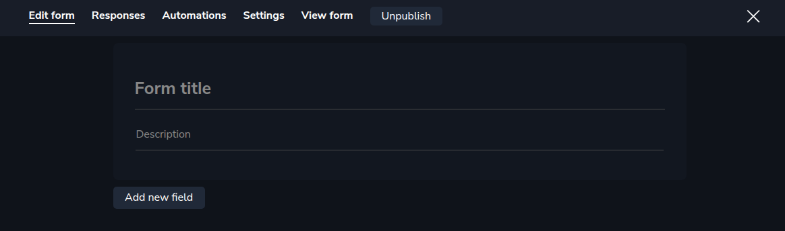
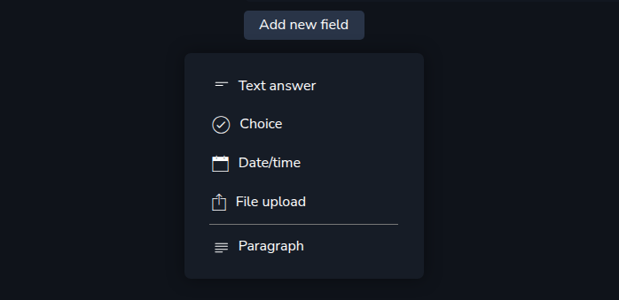
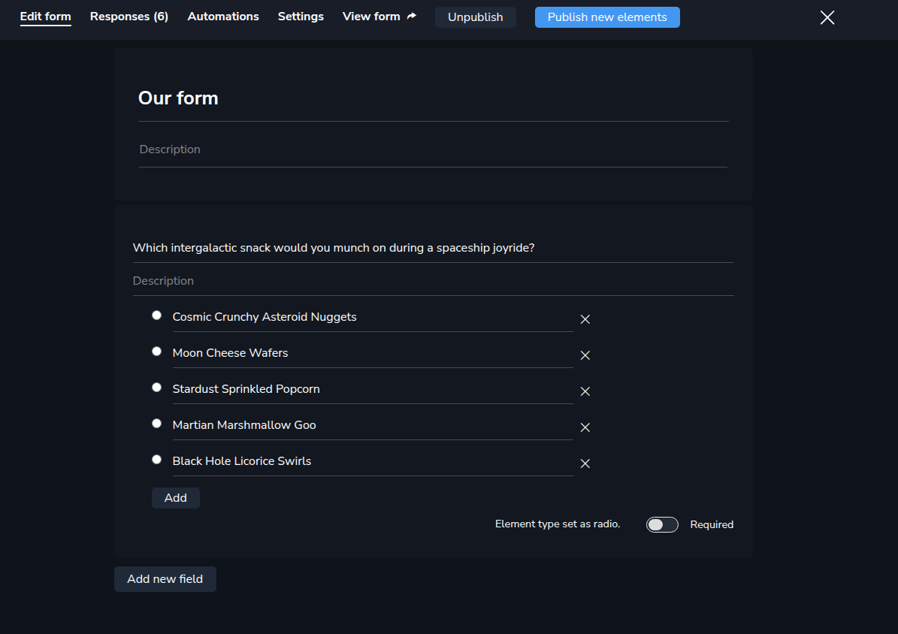
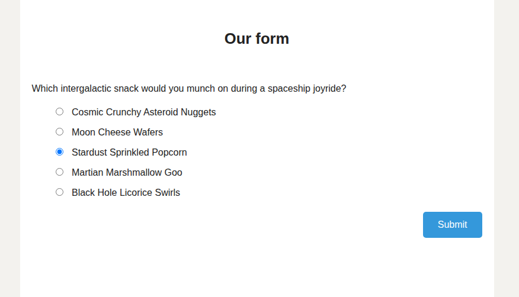
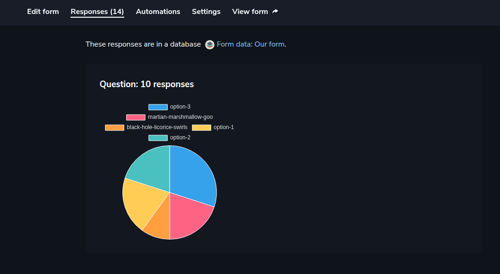
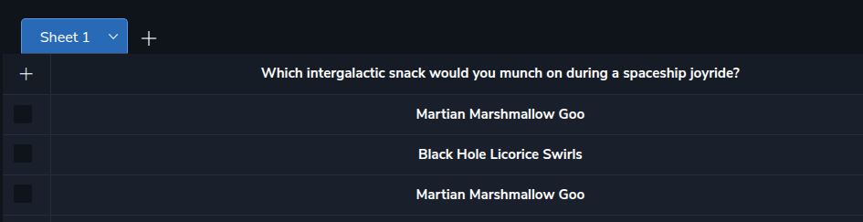
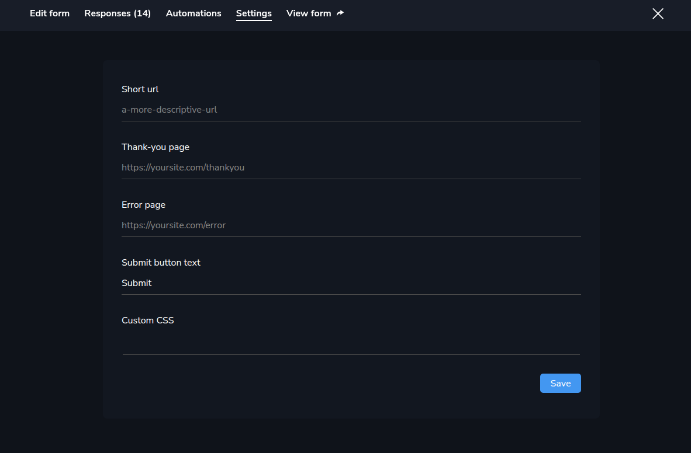

Let’s see how we can use Aamu.app’s Form Builder to create survey forms. 

First we go to Forms section and create an empty form:

Which looks like this:

Start by adding the Form title and Description, if you so choose.

After which you can start adding form fields.

Text answer and Choice is probably the most common. Let’s add a Choice:

With Choice, you have three different ones: radio buttons (select one from many), dropdown box (select one from many) and checkboxes (select many from many). Here we have radio buttons, and it looks like this as the final form:

Let’s add some data (fill the form and Submit it), then look at the Responses page:

You get a nice graphic of the answers. You can see the detailed data in Databases:

In Form settings you can set all kinds of useful behavior, like a friendly URL, a custom thank-you page or custom CSS:
<h2 xmlns="http://www.w3.org/1999/xhtml">Forms and Databases</h2>
Since each form submission creates a database entry, all the features, that are available for databases, are also available for form data. One particularly useful feature may be Database automations — which means that when a new database row (form submission) is added, you can define different actions for it. One action may be to send an email, another may be to create a Task.

We will look at Database automations next!

