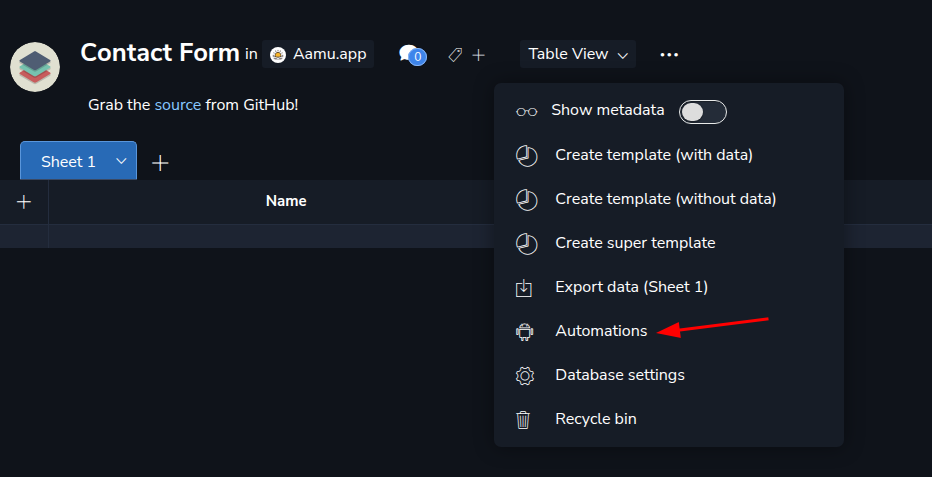
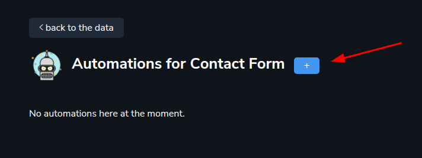
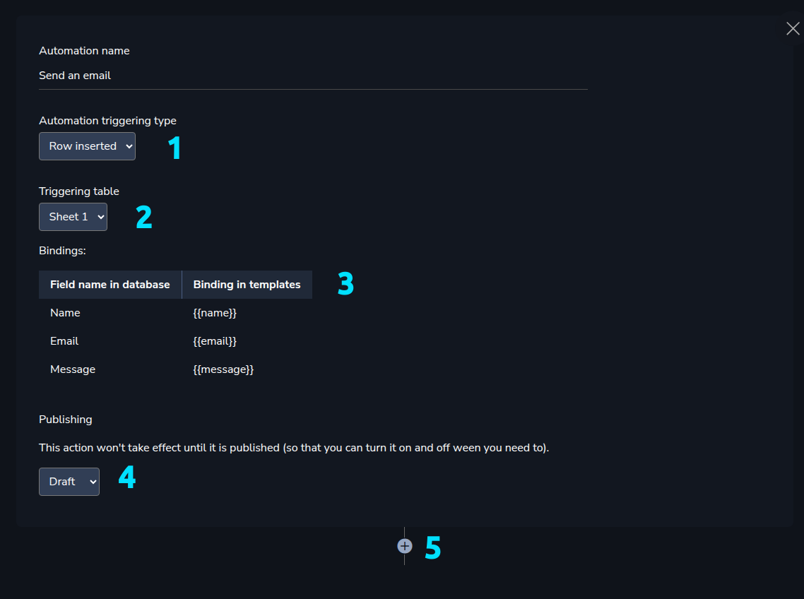
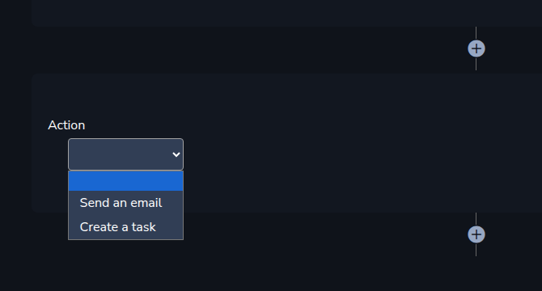
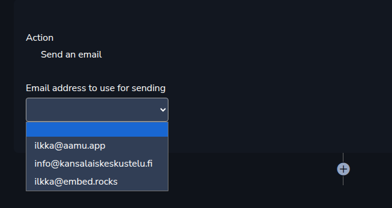
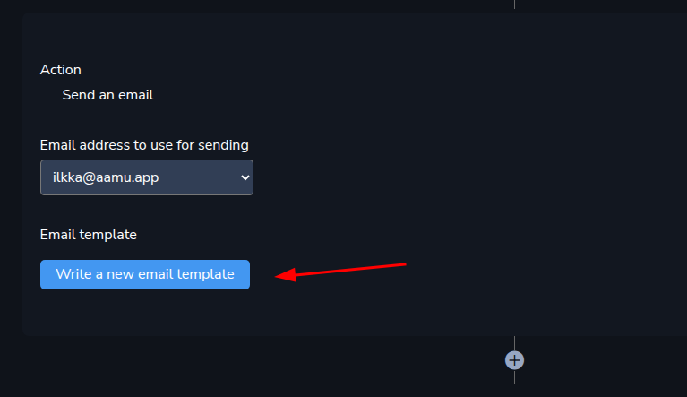
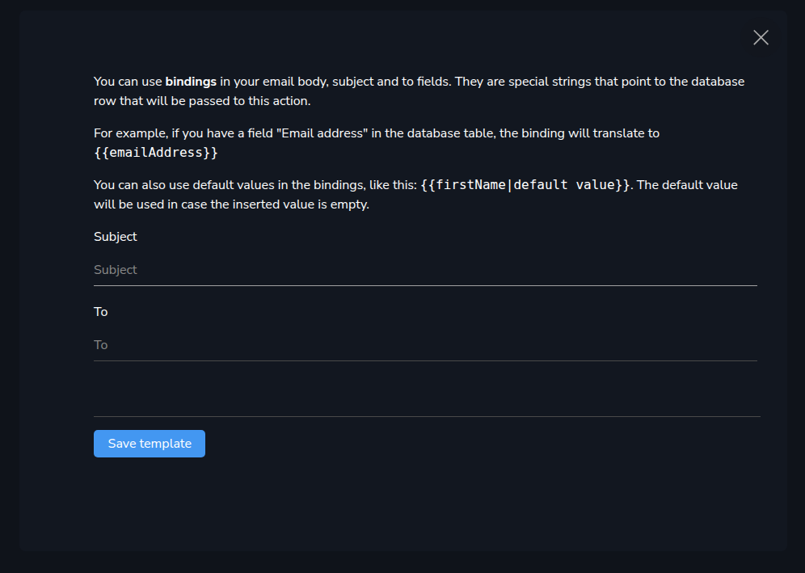
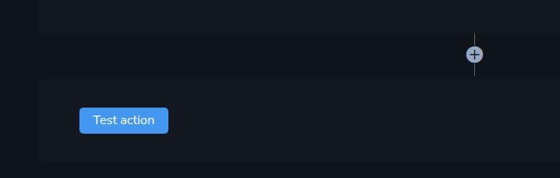

Earlier we created the contact form. Let’s spice it up a little bit — let’s create an automation for it! 

Since we might want to get an email notification when someone sends us a message through the contact form, let’s do that. Let’s create an automation that sends an email to us.

We start by going into the contact form database and in the 3 dots menu you will see “Automations”.

And you will see an empty page of Automations. Let’s create one:

Next you will see a few things, which I will explain here:
<ol xmlns="http://www.w3.org/1999/xhtml"><li>
The Automation will be triggered by some event. At the moment, only <code>Row inserted</code> is supported.
</li><li>
Triggering table. We need to specify, which table triggers the Automation.
</li><li>
Bindings. When the row is inserted, it has some data, and the different fields are named by some human-readable name which tells what the data is about. Here are those names turned into lowercase character strings, wrapped in <code>{{}}</code>. You can use these bindings in the email that you send out. For example, the <code>{{name}}</code> means the name that the person gave and <code>{{email}}</code> is his/her email address.
</li><li>
Publishing. When you are ready to take this Automation into use, set this to Public.
</li><li>
Add action. Your automation needs actions — at least one. Add it here.
</li></ol><h2 xmlns="http://www.w3.org/1999/xhtml">Actions</h2>
Your automation needs actions. Currently, two types of actions are supported: 
<ol xmlns="http://www.w3.org/1999/xhtml"><li>
Sending an email
</li><li>
Creating a task
</li></ol>
And email needs a sender. And we can only use a sender that we have specified by ourselves. So, in case you haven’t set up Emails yet, now would be a good time to do that.

Here are the email accounts that I have set up, and I can choose from one of them:

Next we get to the main point — writing the email template that will be used for sending.

Here is the screen for writing email templates:

The <em>Bindings</em> are explained there again — how they work. You can use them in the body section of the email. And the actual bindings you saw in previous section.

The <em>To</em> field would be the email where you want the email to arrive at. The <em>From</em> field was set earlier.

You can write a template like this, for example:

Subject: Contact form submission To: youraddress@gmail.com Body:
<pre xmlns="http://www.w3.org/1999/xhtml"><code class="language-html">Hi me!

Someone just filled our contact form with this information:

Name: {{name}}
Email: {{email}}
Message: {{message}}</code></pre>
Click <em>Save template</em>.

At this point just change the <em>Publishing</em> to <em>Public</em>. When you do that, you can test the Automation:

Then just start waiting for the emails to pour in!

