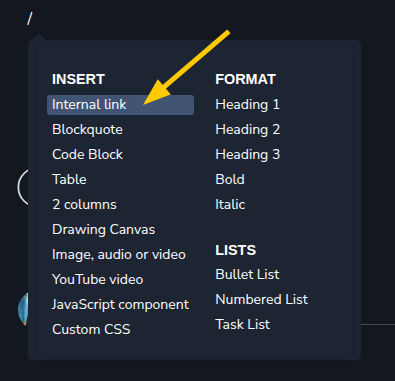
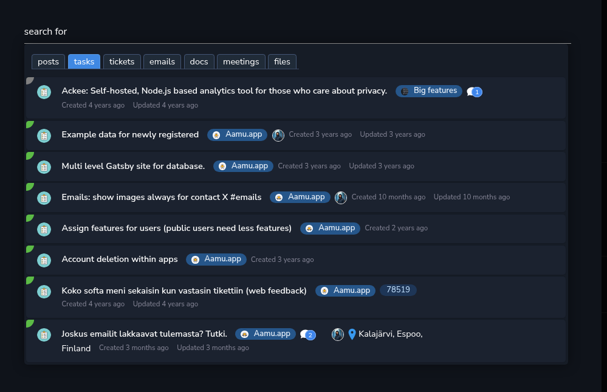
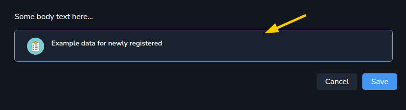

Everywhere that you write <em>content</em> in Aamu.app, i.e. comments, tasks, docs etc., can can add <em>internal links</em> with the slash menu:

There you are presented with a dialog window, which has a search input box:

Here my search term is “search for” and it is currently searching for tasks. I can search for any item types in Aamu.app. Switching between tabs can be done with a mouse (obviously), but also with the shortcut <code>Shift + left</code> and <code>Shift + right</code>.

When you click the item that you want to create a link to, this will be added to the document:

It will add a familiar box into the document/comment that you are currently writing. 

Clicking the box will take you to that item. Pressing <code>Esc</code> will take you back.

This is how easy it is to reference other items in Aamu.app. You can link from everywhere to anywhere!

