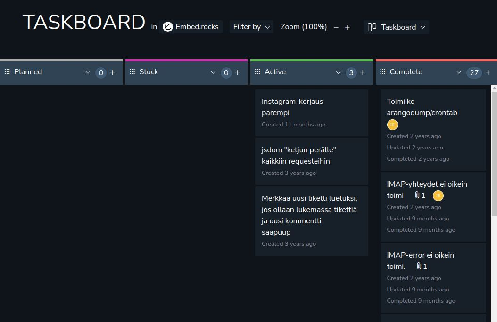

---
author: "Ilkka Huotari"
title: "Introduction to Aamu.app"
date: "2021-10-10T09:00:00.000Z"
modified: "2024-03-09T05:30:12.123Z"
description: "Aamu.app is an all-in-one productivity tool"
cover:
  image: 1709958325939.jpg
tags: []
ShowToc: false
ShowBreadCrumbs: false
---

Aamu.app is an all-in-one productivity tool, containing a lot of tools that a company needs to get work done collaboratively.

First, let me say who is behind all of this and why you should trust this tool.

Why you should trust this tool?
-------------------------------

Warning: a long explanation ahead.

I’m Ilkka, a software developer/entrepreneur from Finland. My time is spent in coding, being in nature, and being a dad, all of which I greatly enjoy. I have another business. [Embed.rocks](https://embed.rocks/), which is an API service and I have been running it for a few years now.

Trust is an important issue in a tool like this. That trust will be built in time, and at the moment I can only say things. There are several reasons why you should trust this.

First, as a software developer, I’m quite experienced, having been working in several companies in Finland and after those, on my own. That’s multiple decades.

From the technical standpoint,I have tried to distance Aamu.app from the user’s data. That means that everything important is encrypted, server-side, with user's own key (password). It means that even I, or anyone outside of that particular user/team cannot access that data. Meta-data, like timestamps and such, are not encrypted in a similar fashion, but mostly everything that the users are inputting by themselves, are. Some exceptions exist, which will be talked about later.

This server-side encryption also means, that if you, the user, lose your password, you cannot access your data after that. So you should really keep good care of your password, i.e. save it in a safe place! **There is no “forgot password” feature at all**!

The third reason why you should trust this tool is that there are really no costs of running this. The server hosting fees are small and easily covered by my other business. Besides the hosting fees there are no other costs. So, this will stay online as long as I am alive and well. There is a possibility that something happens to me, and then this service could go down. I will hire someone to help me with this as soon as I can, so even this will not be an issue in the future.

You, the user, can also download all your data at any point, so you can make backups and take the data with you as you wish.

So, what is Aamu.app anyway?
----------------------------

It’s a productivity tool, but you knew that already. So, let’s get a little deeper.

The plan is to have everything that a company might need for its most important, daily productivity/office tasks, in a single package. Along that there should be collaboration integrated throughout tool. The user interface should be unified throughout. And of course everything should be easy to use.

That’s the plan and this is the start. Let’s see what we have so far.

Features
--------

So, even though there are quite a lot of features, the combination shouldn’t feel overwhelming. This, like already said, the user interface will be unified.

Tasks
-----

Tasks are an important feature. Just about every company needs tasks.

The tasks have a few different views:

1.  list
2.  kanban board
3.  calendar
4.  timeline

Above, you can see the list, which is the standard view. Below there is the kanban board.

Here we have the calendar, which looks and works just like Google Calendar. Oh, and there is also the Google Calendar synchronization – your events will do an automatic two-way with Google Calendar. And also with iOS calendar, should you have synchronization with that and Google Calendar, like most probably will. 

Helpdesk
--------

Helpdesk is also important and almost every company needs one. With helpdesk, you can handle customer support through what is called _tickets_. These tickets are currently created by email or by live chat (real time chat on your marketing website). In the future we may expand to handling customer support through social networks, but currently it’s just email and live chat,

By the way, at this point you may have noticed, that every main level feature looks and feels pretty much the same. This familiarity is important for the unified experience through our service.

To connect the helpdesk to an email account, you will need an IMAP connectivity, at the moment, We will improve this later so that IMAP isn’t needed.

The data (text) in tickets is encrypted – with the exception of titles. The titles are needed for creating email threads and titles are not encrypted.

Emails
------

You may start to see that all the features resemble each other quite a bit. That's intentional — the same familiar user interface greets you everywhere in this app. No need to learn many things, just one and its variations.

The emails feature is what you would expect, emails – for all of your domains.

Documents
---------

  

Documents are like Google™ Docs, they may or may not be important for you. With this you can create all sorts of documents or ebooks (pdf). You can publish them for the world to see or you can keep them for your own use. In case it’s for your own use, everything is encrypted, but if it’s published, then it’s not encrypted – so you decide how secure you want them to be,

The data in the documents is totally secure – it’s encrypted with your team’s key. If you share the document with the world, then it is made plain text and unencrypted.

Database
--------

Databases can be used for a lot of things and they can be easily connected to outside world. For example, I am using the database feature as a _headless CMS_ for this very blog. I am currently writing this blog post in the database – you can see that in the picture above. You can also get the JavaScript sources for this blog [on GitHub](https://github.com/AamuApp/aamu-blog).

Databases can be used for blogs, contact forms, single page apps, e-commerce sites, CRMs (customer relations management) and so on. There is a GraphQL and forms API to connect your sites to the database. And of course we have a lot of templates to start with.

Also the data in the databases is encrypted, unless you choose them to not be. If you create an API key, then the data will become unencrypted – so you may use the GrahphQL feature, or API key, in only the databases where data security isn’t the top priority. At least for now.

Forms
-----

With the form build you can build forms. The data will go to the database (where you can see it separately and do all the things you can do with databases) and also the summary of the data (answers) will be shown to you.

Video Meetings
--------------

Meetings,mean online, or video meetings, as is quite usual today. We are using [Jitsi](https://jitsi.org/) for this, which is well tested and secure video conferencing software, also open source.

You can invite participants to the meetings who are not users in Aamu.app , i.e. they are outside guests.

Note: meeting names are not encrypted for technical reason (the notification system needs to “see” the names).

Designs
-------

  

We have integrated Penpot ([https://penpot.app/](https://penpot.app/)) into Aamu.app. Penpot is like Figma, but Open Source!

Security
--------

As you may have noticed, we have talked a bit on encryption. What this means in practice, is that all the important data (things you upload, data in tasks, databases, helpdesk, etc.) is encrypted with your team’s key and only your team can access that data. The encryption happens on the server, so this isn’t end-to-end encryption. But this is still a lot more secure than _not encrypting_ the data, as then a hacker might get access to it.

_Don’t lose your password, though!_ As the data can be accessed only with your key (your password), only you and your team can access it. We don’t have access to your unencrypted data!

Pricing
-------

Some of you may wonder what’s with the price, which is $5/user/month, with the free option there as well. That seems kind of low, right? Yes, it kind of does.

I have always, personally, looked for “good deals”, i.e. bought things as used and generally gone for things that offer good value for the price. This is prices similarly. I like if everybody can afford this and if this offers a good value. I understand that the price can “send a signal” but I have chosen not to worry about it. I believe (or hope) that people will notice the value of this service – in time.

What about that name?
---------------------

Aamu means “morning” in Finnish. I think it’s also quite a beautiful name, aesthetically. And it comes early in the alphabetics. It’s simple and distinctive. And most people start working in the morning 😃.

That’s it!
----------

So, that’s it so far. There are perhaps some features missing that you might expect. For example email – currently you can use the _helpdesk_ for basic email activity, but we will create a more complete email experience later (or, next, actually).

[Try it out](https://aamu.app) and leave us feedback by clicking the email icon on the bottom of the screen. We would really appreciate the feedback. Thanks!
