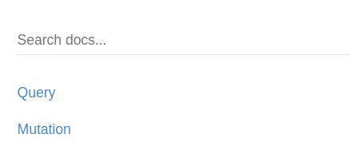
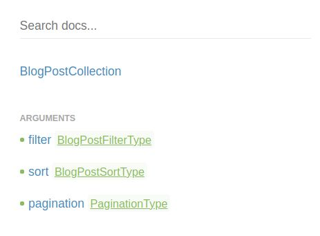
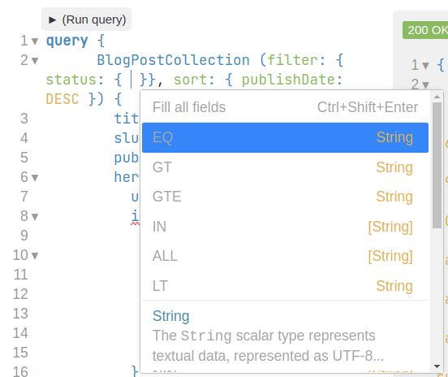

---
author: "Ilkka Huotari"
title: "Introduction to Aamu.app GraphQL"
date: "2021-10-19T09:00:00.000Z"
updated: "2021-10-20T05:10:20.553Z"
description: "How to use the database from a distance"
cover:
  image: 1634671479716.jpg
tags: ["graphql"]
ShowToc: false
ShowBreadCrumbs: false
---

Aamu.app database supports two APIs: you can submit data into a database via just standard _html forms_ – this works just one direction – to add data into the database. Also, you can get and put data into the database via _GraphQL_.

As Wikipedia [says it](https://en.wikipedia.org/wiki/GraphQL), "GraphQL is an open-source data query and manipulation language". It's a query language, and it has a syntax for reading and writing the database. For testing it out, it is helpful to have a tool. I like [Altair](https://altair-gql.sirmuel.design/).

To use Altair, or any similar tool, you first need to setup it with some information about your database; the database endpoint and the database API key. You can get the API key from the _database settings_. The database endpoint is this: `https://api.aamu.app/api/v1/graphql/`.

After you have set those, there is the option to the get database schema. The schema will help you to query the database. In Altair the schema is called _Docs_. If you change the database structure, you can refresh the schema in the tool of your choice. In Altair, there is a refresh icon, which has a tooltip to _Reload Docs_.



You can browse around the schema. On the top, the schema has the following parts: _Query_ and _Mutation_, which stand for reading and writing.


## Querying the database

Let's see, what we have in _Query_. We see that there are some fields, which correspond to our sheets (or tables) in our database. I am using the _aamu-blog_ as an example, and in the aamu-blog there are two sheets: _Blog post_ and _Person_. 

For each sheet there are two ways to query it: to get one specific row from it and to get multiple rows. Let's go through each case.


To get a single row, in this case a blog post, you would query it through one of its _unique fields_. You can set the field as unique by editing the _column properties_ in the database sheet. There is a checkmark that makes the column _unique_. For blog posts, the slug is marked as unique. Slug stands for "part of the url":


So, you can get these blog posts by knowing its _slug_ or by its _ID_. In practice, in this blog application, you would use the slug, as that is something that you know – the user will enter the url in the browser and that url will have the slug. So you use that slug the retrieve the correct blog post.

Here is an example how you would query a single blog post (this particular one). In the parenthesis you would enter the unique field and in the braces you would enter the fields that the query should return for this particular item.

```graphql
query {
  BlogPost (slug: "introduction-to-aamuapp-graphql") {
    id
    created
    updated
    title
    slug
    description
    body
    publishDate
    status
  } 
}
```

You can also get items by querying the field _BlogPostCollection_. This gives you from zero to multiple rows. You can also do filtering, sorting and pagination. In practice you probably will want to do at least filtering.



Let's see how the filtering goes. By clicking _filter_, you will get a list of fields by which you can filter. In practice you can filter by any field in the sheet. 

Let's see how _aamu-blog_ gets the blog posts for its main page. It will filter by `status` and sort by `publishDate`. Here is the query:

```graphql
query {
  BlogPostCollection(
    filter: { status: { EQ: "published" } }
    sort: { publishDate: DESC }
  ) {
    title
    slug
    publishDate
    description
  }
}

```

You will notice that we have used `EQ` to filter for `status`. For retrieving single items through unique fields this isn't needed, as the item is always retrieving by the exact same value, but for retrieving multiple items there are more possibilities. In Altair, you can get help by pressing _Ctrl + space_. Altair will give you a list of options how you can filter, like this:



`EQ` stands for "equals", `GT` stands for "greater than", `LT` stands for "less than", etc.

For sorting, you can get similar help. There are two ways to sort, ascending and descending:


Pagination is pretty straight forward. You would use it like this:

```graphql
query {
  BlogPostCollection(
    filter: { status: { EQ: "published" } }
    sort: { publishDate: DESC }
    pagination: { limit: 10, skip: 20 }
  ) {
    title
    slug
    publishDate
    description
  }
}
```

That covers querying the database. 
