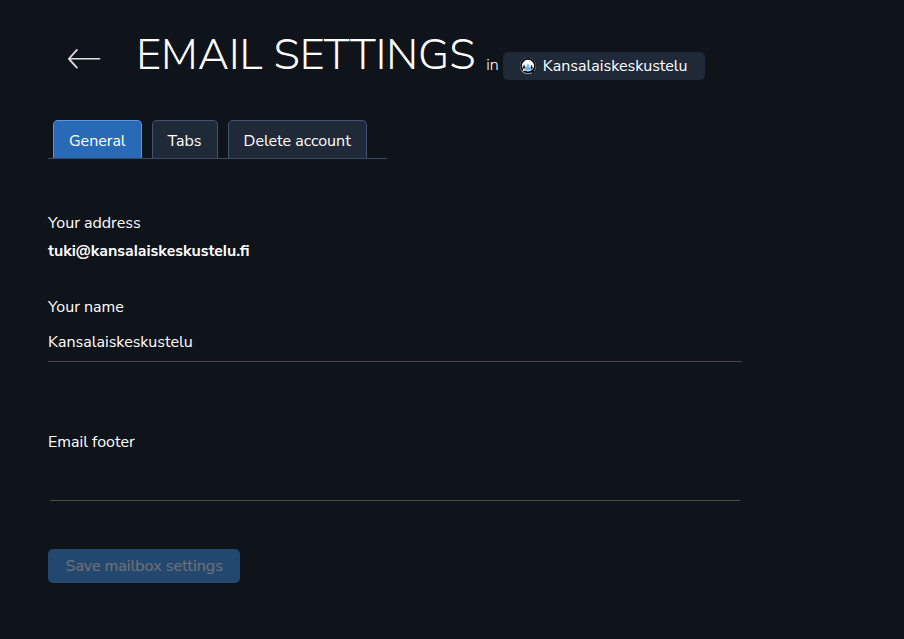

Let’s tackle a bigger subject — emails. Due to the nature of the game, it involves some pretty techy stuff, domains and other scary things. This is the same for Helpdesk, which shares those domain settings with Emails.
<h2>Email domain</h2>
Emails work so that one project can hold one <em>Email domain</em>. This project can hold one email account for each project user. Those email accounts are personal — others won’t be able to see your email account’s emails or contacts.

Email domains are created in <em>Team settings</em>. First you need to add an email domain. Let’s do that now.

Go to Profile icon ➡️ Team ➡️ Email domains. To add a new domain, click the plus button:

And proceed to add the domain. Note that you can choose between Aamu.app’s email (IMAP) server and a third party IMAP server. So, that’s some extra flexibility. 

Let’s use Aamu.app’s IMAP server.

After we have added it, we get to the screen where the domain will be verified through the DNS data. For this you need to get to the site that holds the DNS data for your domain, for example Cloudflare. The data that you should enter into your domain’s DNS data looks like this:

There are four fields to set. So just set them, copy-paste from the screen to the site that holds your site’s DNS data. After clicking <em>Verify</em> you should hopefully see this:

If the verification didn’t succeed, just try again until it does.
<h2>Attaching the domain to the project</h2>
After the hard part, DNS verification is done, there is still one more step until we get to create our mailboxes. 

This should be simple enough. In the Project settings, i.e. Projects ➡️ Your Awesome Project ➡️ Email you can attach the domain you just added to the project where you want to use it.

<h2>Mailboxes</h2>
After that we get to adding the mailboxes for those who want to have a mailbox in this domain. Each user will create his/her mailbox and that will happen in when you go from the site’s main navigation (right-hand side) section <code>EMAILS</code> ➡️ select your project ➡️ Email settings:

So, here you will choose your email address and your full name. 

After that you will be able to set something more: the email footer, which will be appended to the emails you send. And also Tabs, which are like folders.
<h2>Done!</h2>
After this the email is set, you can receive and send emails.

There are some features that we hope you will like in the email client, but you will find those by your own.

