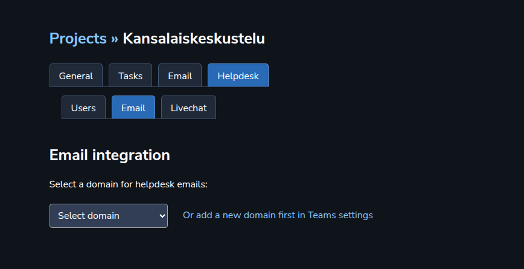

This time, let’s setup Helpdesk.

We are going to use emails as the Helpdesk “route” here — people will contact us through the email. 

For emails, we need a domain. We covered domain setup earlier in the <a target="_blank" rel="noopener noreferrer nofollow" href="https://aamu.app/blog/posts/setting-up-emails-in-aamuapp/" id="eb6e4907-75f1-4b0e-8083-f09c15d53128">Emails section here</a>. So, go read that first and set up your email domain with those instructions.

After that we are going to set up the Helpdesk, which continues in Project settings. 
<h2>Users</h2>
First, we are going to add some users to our Helpdesk project. Only those users will be able to access the Helpdesk project. Do it here:

In Helpdesk ➡️ Users you will be able to add users to your Helpdesk project.
<h2>Emails</h2>
Then, let’s set up the emails for our Helpdesk. Going to the right tab, it looks similar to what we saw earlier when setting up emails in general. You would attach a domain to this project:

Let’s attach our <a target="_blank" rel="noopener noreferrer nofollow" href="http://kansalaiskeskustelu.fi">kansalaiskeskustelu.fi</a> domain to our Helpdesk project, and we see this:

We will have only one email account per a Helpdesk project, and we will set up the email account here, in Project settings. So, let’s just fill in the blanks and click “Set…”.

After that you can go to the Helpdesk section, and start waiting for the emails to come in. 🤓 
