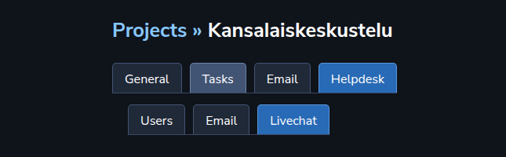
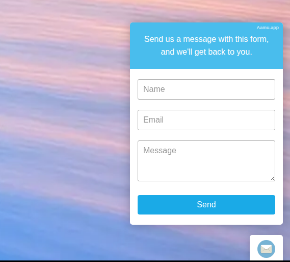
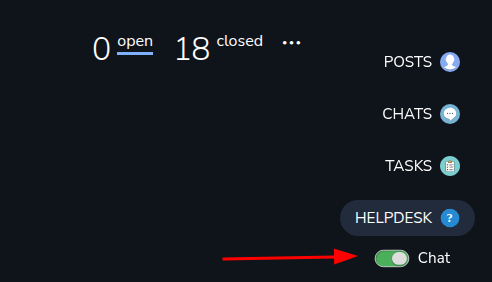
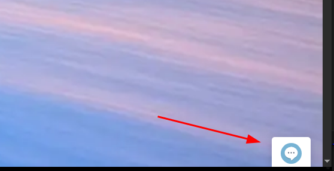
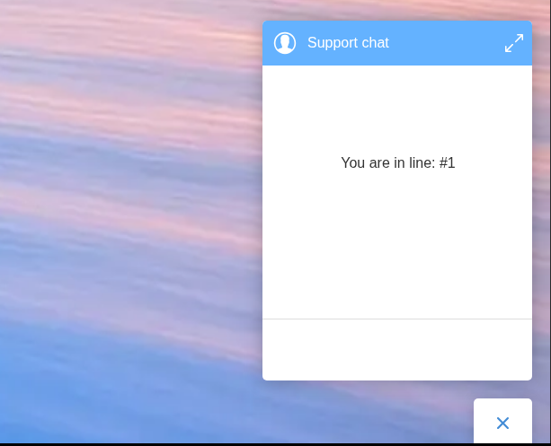
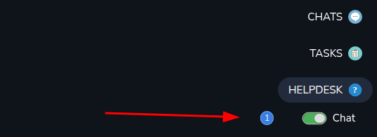
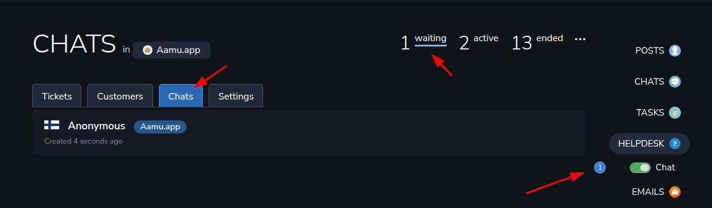

In Helpdesk, there is also a Livechat which you can add to your website. Although it says “chat”, it can also handle emails, when there is no support agent answering to chat requests. Let set that up now.

First you would add users to the Helpdesk project at Projects ➡️ Helpdesk ➡️, like before when we set up the emails for Helpdesk. Only those users will be able to access the Helpdesk project.

Then, to set the Livechat, you would do it at Projects ➡️ Helpdesk ➡️ Livechat:
<h2 xmlns="http://www.w3.org/1999/xhtml">Livechat translations</h2>
In the settigns for Livechat, there are some texts, which you can translate to your needs. You can basically translate everything that appear in the Livechat widget, so you don’t have to show English on a non-English site.
<h2 xmlns="http://www.w3.org/1999/xhtml">Livechat embed code</h2>
On the settings page, at the bottom, there is the embed code, which you would put to your website. So, just copy-paste the code to your site, and you should be all set. The code looks like this:
<pre xmlns="http://www.w3.org/1999/xhtml"><code class="language-html">&lt;script defer src="https://ilkkah.aamu.app/livechat.js"&gt;&lt;/script&gt;
&lt;aamu-livechat data-username="" data-useremail="" data-host="ilkkah" data-pid="ba09173eaddc06b9c88423723dd266a4"&gt;&lt;/aamu-livechat&gt;</code></pre>
There are a couple of things you can set if you need more control. On sites where people log in, you can set the username and/or email address for each user before they click the chat widget. This is optional, but will let the Helpdesk know exactly who you are talking with.

After this is done, you should see this in the bottom right corner of your site:

That’s the Livechat widget. 

At the moment it shows the Email icon, which means that the widget will function as an email-sending widget:

You can control the widget’s behavior at your Aamu.app site:

When you go to the Helpdesk project, there is an option to enable or disable the chat functionality of the widget. If you want to be available for chatting, you would turn that on, and the widget changes the appearance:

Now, as you see, the chat widget shows a chat bubble — it will be used for chatting.

When someone clicks that, it will show a waiting line, until you accept the chat request:

At this point you will see a notification in the right-hand navigation bar:

You can also see the incoming chats in Helpdesk ➡️ Chats ➡️ waiting:

You will see the country flag where the chat is coming from and the user’s name. Normally it will be Anonymous, but in case you used an authenticated chat, you will see the user’s real name,

So., just click the chat and start chatting. A Helpdesk ticket will be created after the chat is done, and the chat will be attached to that ticket. That way you can keep all the issues in the same place, no matter if they come through the email or chat.

