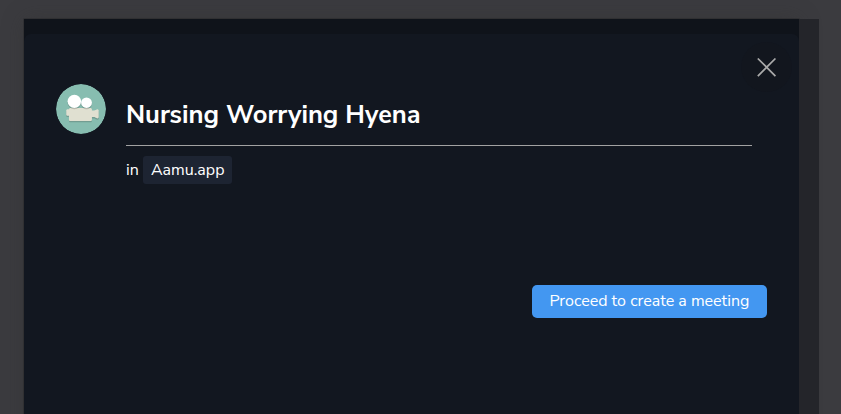

Let’s go through the Aamu.app Video Meetings.

We are using <a target="_blank" rel="noopener noreferrer nofollow" href="https://livekit.io/" id="4d060849-1312-4f49-8381-c585fedf606b">LiveKit</a>, which is a modern, open-source, scalable video and audio platform. Our video calling feature resembles Zoom and Microsoft Teams, except that it is of course integrated well with Aamu.app in every way.

As you have probably come to expect, the main section of Meetings resembles every other section in Aamu.app:

You have the familiar project picker, the blue plus button for creating a new item (meeting in this case) and tabs (upcoming, past).

Let’s create a Meeting:

There will be a default name suggested, you can change this, or you can just accept it. At this point the Meeting will be in <code>draft</code> mode. Let’s accept it:

We need a starting time for the meeting, let’s add that:

Now as we have the starting time, we can do something more: we can invite people (you as the creator are already invited) and we can join the meeting.

You can invite people from your Aamu.app team or people from outside the team with an email address only.

When you invite new people, they get the notification email of it automatically, but you can send the notifications again in case you need it. Notification emails will have the joining link.

Let’s join it (with our mobile phone):

We are using the back camera for now.

It’s basically a simple video calling app. There is a chat and a screen sharing feature (on desktop).
<h2>Integration with Aamu.app</h2>
At the moment there are two other ways to create a meeting what I just showed:
<ol><li>
When you are creating a task: if you set a starting and ending date for it, there is an option to create a video meeting for it.
</li><li>
In the <a target="_blank" rel="noopener noreferrer nofollow" href="https://aamu.app/blog/posts/aamuapp-as-a-calendly-alternative/" id="515980f0-1b3c-49bb-ac13-1b31fc15c0a5">event calendar</a>.
</li></ol>
In the future there will be other ways that you can create a meeting — like with <a target="_blank" rel="noopener noreferrer nofollow" href="https://aamu.app/blog/posts/database-automations-with-aamuapp/" id="d901dc9e-824e-4ac2-aa9b-9ca7731abb93">Database Automations</a>.

